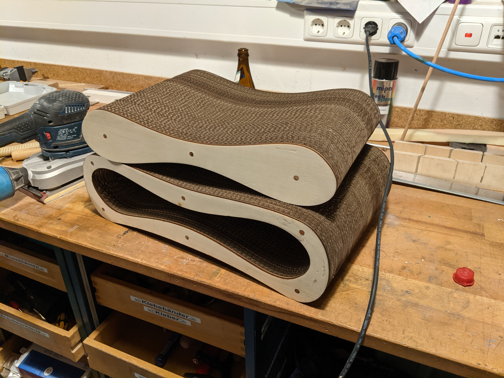

# Cat Scratching Board

If you have a Laser and some cardboard you can build an easy cat sratching board. Just use 8mm wooden beams to connect everything.

## Copyright and Authorship
Everything is licenced under [CC-BY-SA 4.0](https://creativecommons.org/licenses/by-sa/4.0/) - [Timo Schindler](https://www.timoschindler.de).
